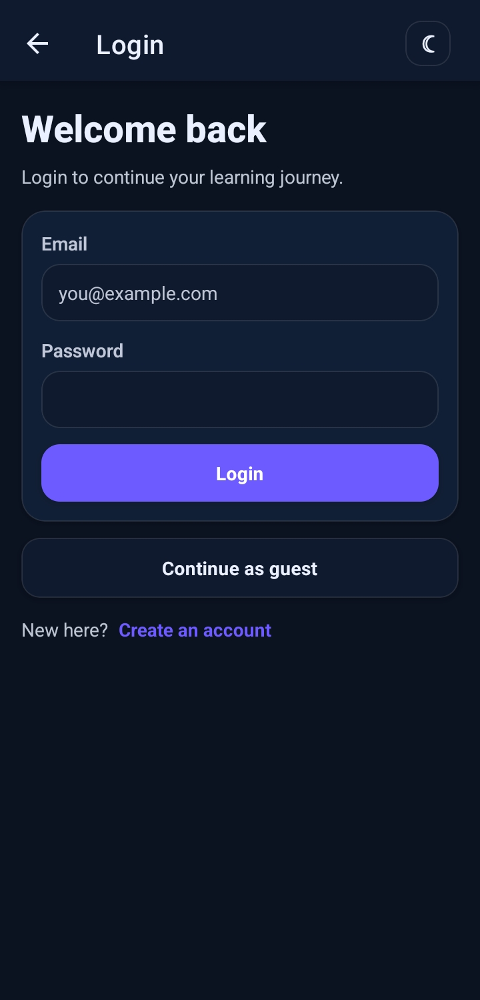
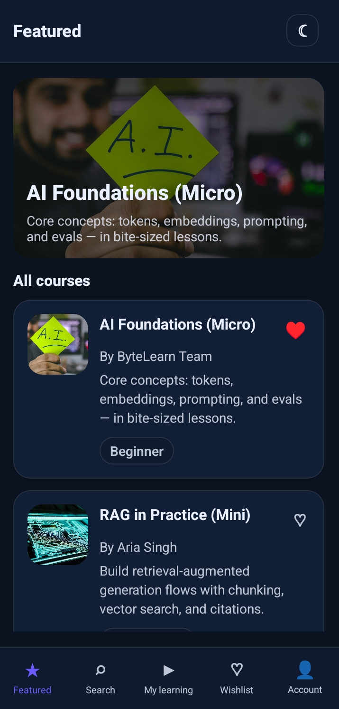
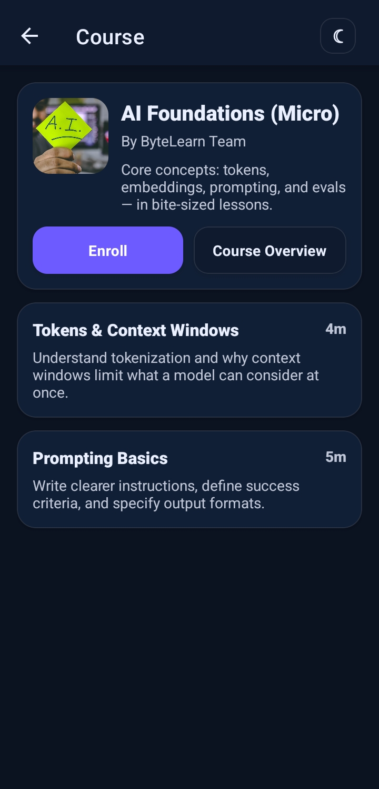
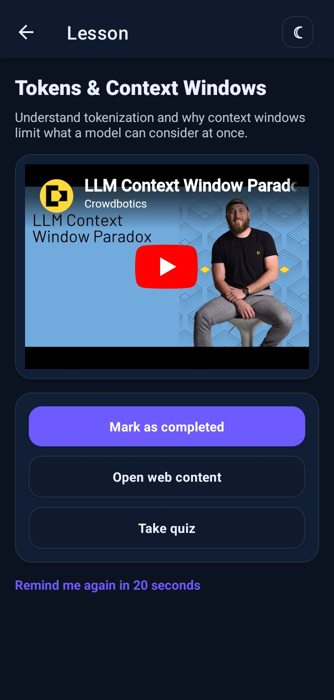
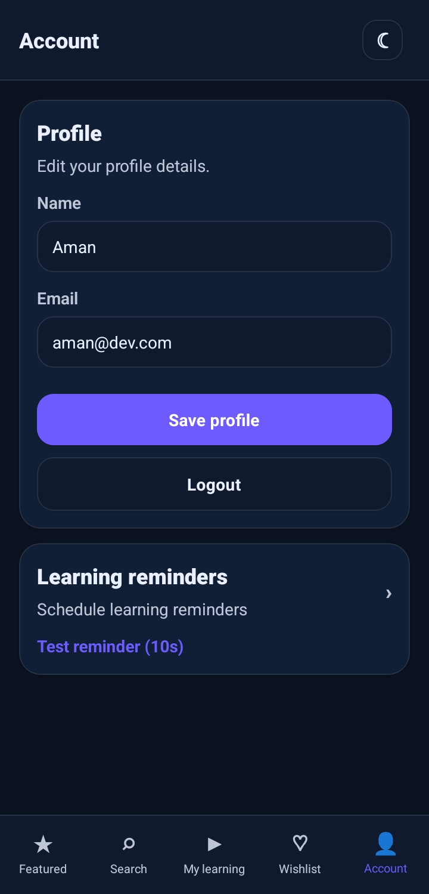
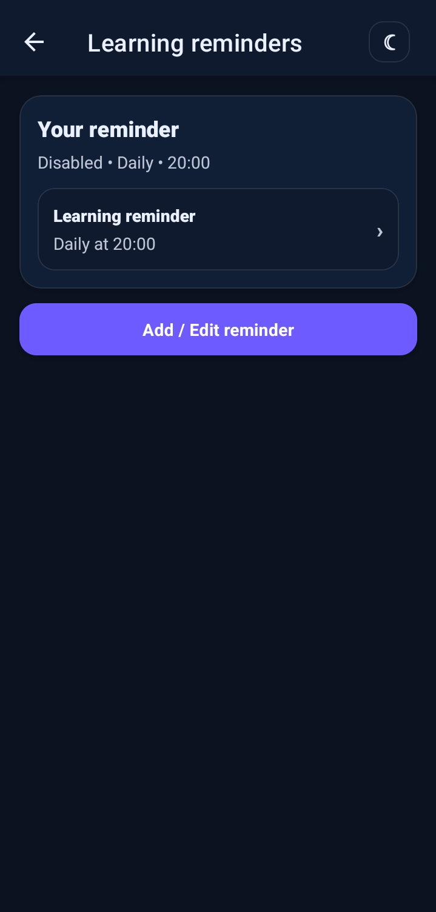

# 🚀 Zynetra — Micro-Learning Mobile App

<p align="center">
  
</p>

<p align="center">
  <b>Learn Smart. Grow Future.</b>
</p>

<p align="center">
  
  
  
  
  
  
</p>

<p align="center">
  
  
  
</p>

---

## 📖 Overview

**Zynetra** is a production-grade micro-learning mobile application built with **React Native (Expo)**, **NestJS**, and **MongoDB**.

Designed for modern learners, Zynetra delivers bite-sized educational content, interactive quizzes, progress tracking, smart reminders, and a seamless cross-platform learning experience.

This project demonstrates real-world mobile engineering skills including:

- Authentication
- Push Notifications
- Deep Linking
- WebView Integration
- State Management
- REST API Integration
- Production Deployment

---

## 🚀 Live Demo

| Platform | Access |
|----------|--------|
| 📱 Android APK | [Download APK](https://github.com/Ritik-Gswmi/zynetra/releases/latest/download/zynetra-latest.apk) |
| 🌐 Backend API | [View API](https://zynetra.onrender.com) |

> **Note:** Zynetra is a native mobile application built with React Native and Expo.
> Install the Android APK on your device to experience the full application.

---

## 📸 Screenshots

<p align="center">
  
  
  
</p>

<p align="center">
  
  
  
</p>

<p align="center">
  
</p>

---

## 🏗️ Monorepo Structure

```bash
Zynetra/
├── backend/    # NestJS REST API
└── frontend/   # React Native Expo App
```

---

## ✨ Features

### 📱 Mobile Application

- 🔐 Secure Authentication (JWT)
- 👤 Guest Mode
- 🎨 Light / Dark Theme
- 📚 Course Discovery
- 🎥 Interactive Video Lessons
- 📝 Quiz System
- 📈 Progress Tracking
- ❤️ Wishlist
- 🔍 Smart Search
- 👨‍🎓 Profile Management
- ⏰ Learning Reminders
- 🔔 Local & Push Notifications
- 🔗 Deep Linking
- 🌐 WebView Integration
- 📡 Offline Mock API Support

### ⚙️ Backend API

- RESTful API Architecture
- JWT Authentication
- MongoDB Integration
- Course Management
- User Progress Tracking
- Scalable NestJS Architecture

---

## 🛠️ Tech Stack

### Frontend

- Expo SDK 54
- React Native 0.81
- React 19
- TypeScript
- React Navigation
- TanStack React Query
- Zustand
- AsyncStorage
- Expo Notifications
- Expo Linking
- React Native WebView
- Expo Video

### Backend

- NestJS 11
- Node.js
- TypeScript
- MongoDB
- Mongoose
- Passport.js
- JWT Authentication

---

## 📦 Installation

### Clone Repository

```bash
git clone https://github.com/Ritik-Gswmi/zynetra.git
cd zynetra
```

### Install Dependencies

```bash
npm -C backend install
npm -C frontend install
```

---

## 🔧 Environment Setup

### Backend

Create `backend/.env`

```env
MONGODB_URI=your_mongodb_connection_string
JWT_SECRET=your_super_secret_key
PORT=3000
```

### Frontend

Create `frontend/.env`

```env
EXPO_PUBLIC_API_BASE_URL=your-backend-url 
```

> For physical devices, replace `localhost` with your machine's local IP.

---

## ▶️ Running Locally

### Start Backend

```bash
npm -C backend run start:dev
```

### Start Frontend

```bash
npm -C frontend run start:go
```

### Alternative Modes

```bash
npm -C frontend run start:tunnel
npm -C frontend run start:offline
```

---

## 🌍 Deployment

### Backend

Recommended platforms:

- Render
- Railway
- Fly.io

Required environment variables:

```env
MONGODB_URI=
JWT_SECRET=
PORT=
```

### Database

- MongoDB Atlas

### Frontend Production

```env
EXPO_PUBLIC_API_BASE_URL=https://your-backend-url.com
```

---

## 🧠 Engineering Highlights

- Production-grade folder structure
- Persistent authentication
- Deep linking via notifications
- Secure WebView JavaScript bridge
- Optimistic UI updates
- Offline development support
- Scalable backend architecture
- EAS Build configuration

---

## 🔮 Future Enhancements

- Social Login
- AI Course Recommendations
- Live Classes
- Learning Streaks
- Leaderboards
- Subscription Payments
- Admin Dashboard

---

## 👨‍💻 Author

**Ritik Kumar**

- GitHub: https://github.com/Ritik-Gswmi
- LinkedIn: https://www.linkedin.com/in/ritik-gswmi/


---

## 📄 License

This project is licensed under the MIT License.

---

<p align="center">
  Made with ❤️ using React Native, Expo, NestJS, and MongoDB
</p>
